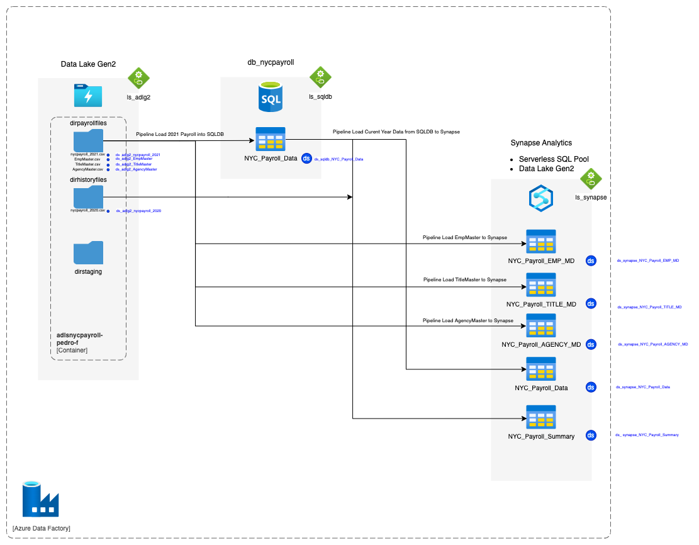
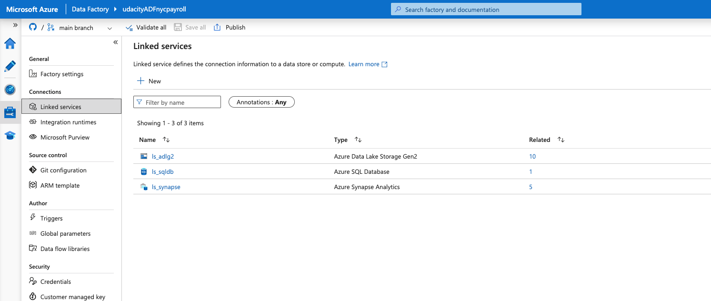
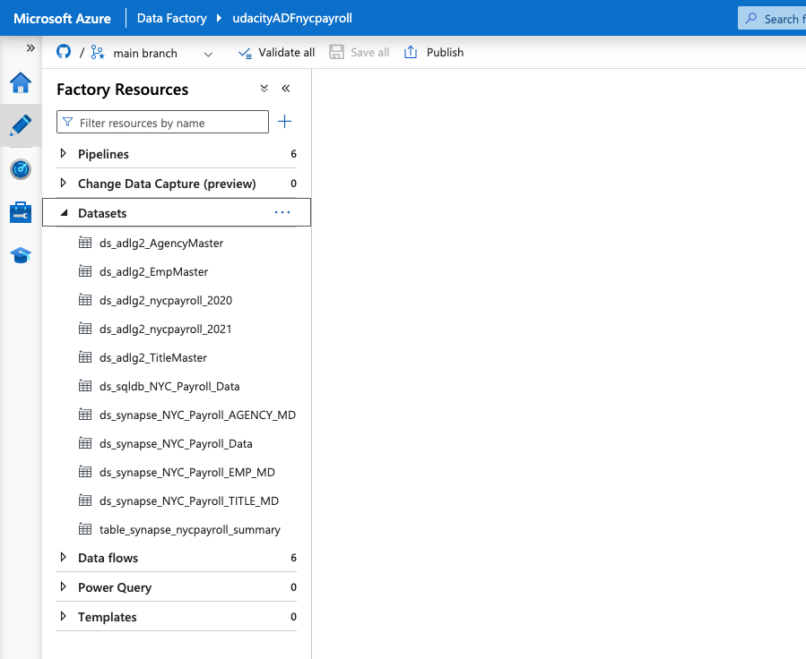
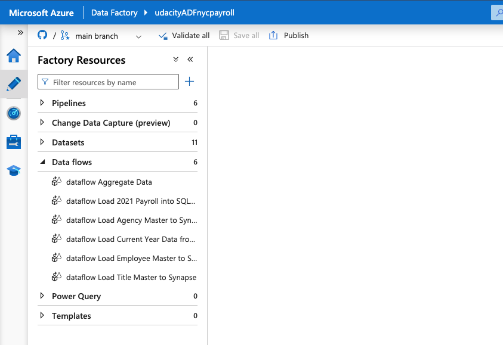
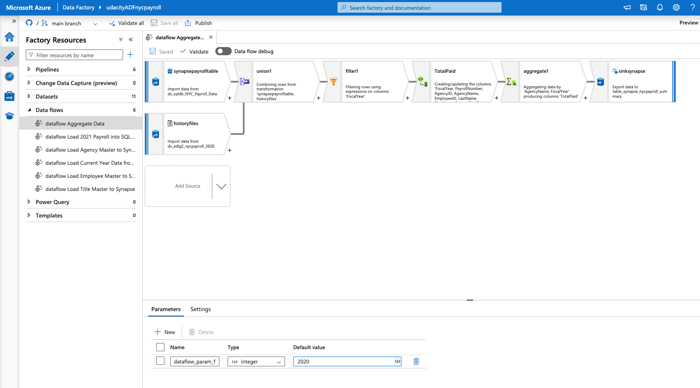
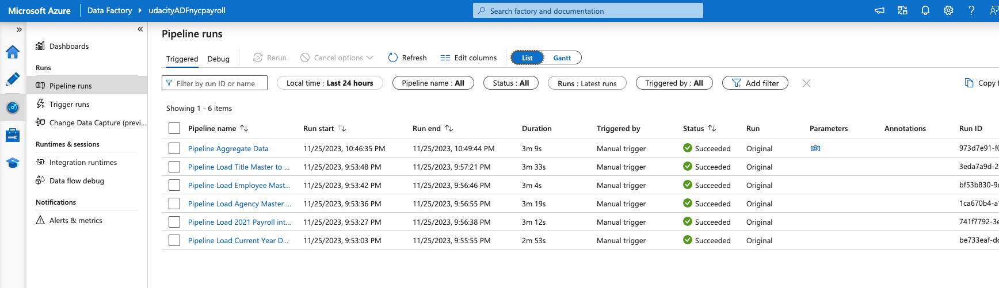
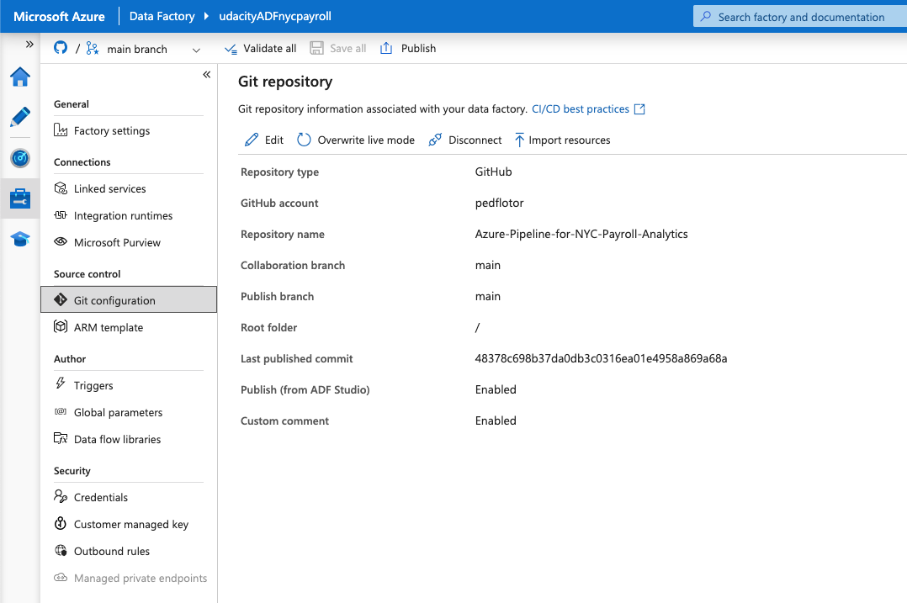

# Azure-Pipeline-for-NYC-Payroll-Analytics
The City of New York would like to develop a Data Analytics platform on Azure Synapse Analytics to accomplish two primary objectives:

1. Analyze how the City's financial resources are allocated and how much of the City's budget is being devoted to overtime.
2. Make the data available to the interested public to show how the City’s budget is being spent on salary and overtime pay for all municipal employees.

The goal is to create high-quality data pipelines that are dynamic, can be automated, and monitored for efficient operation.

The source data resides in Azure Data Lake and needs to be processed in a NYC data warehouse in Azure Synapse Analytics. The source datasets consist of CSV files with Employee master data and monthly payroll data entered by various City agencies.

The Azure Data Factory Pipeline will look like this:



## Project Steps

### Step 1: Create and configure Azure resources
**1. Create the data lake and upload data**

Create an Azure Data Lake Storage Gen2 (storage account) and associated storage container resource named adlsnycpayroll-yourfirstname-lastintial. Create three directories in this storage container named:

- dirpayrollfiles
- dirhistoryfiles
- dirstaging

Upload these files from the project data to the dirpayrollfiles folder:
- EmpMaster.csv
- AgencyMaster.csv
- TitleMaster.csv
- nycpayroll_2021.csv

Upload this file (historical data) from the project data to the dirhistoryfiles folder
- nycpayroll_2020.csv


**2. Create an Azure Data Factory Resource**


**3. Create a SQL Database to store the current year of the payroll data**

In the Azure portal, create a SQL Database resource named db_nycpayroll
- Add client IP address to the SQL DB firewall

- Create a table called NYC_Payroll_Data in db_nycpayroll in the Azure Query Editor with this SQL Script:

```
CREATE TABLE [dbo].[NYC_Payroll_Data](
    [FiscalYear] [int] NULL,
    [PayrollNumber] [int] NULL,
    [AgencyID] [varchar](10) NULL,
    [AgencyName] [varchar](50) NULL,
    [EmployeeID] [varchar](10) NULL,
    [LastName] [varchar](20) NULL,
    [FirstName] [varchar](20) NULL,
    [AgencyStartDate] [date] NULL,
    [WorkLocationBorough] [varchar](50) NULL,
    [TitleCode] [varchar](10) NULL,
    [TitleDescription] [varchar](100) NULL,
    [LeaveStatusasofJune30] [varchar](50) NULL,
    [BaseSalary] [float] NULL,
    [PayBasis] [varchar](50) NULL,
    [RegularHours] [float] NULL,
    [RegularGrossPaid] [float] NULL,
    [OTHours] [float] NULL,
    [TotalOTPaid] [float] NULL,
    [TotalOtherPay] [float] NULL
) 
GO
```

**4. Create a Synapse Analytics workspace**
- Create a new Azure Data Lake Gen2 and file system for Synapse Analytics when you are creating the Synapse Analytics workspace in the Azure portal.


**5. Create master data tables and payroll transaction tables in Synapse Analytics workspace**
- Use the code in file `create_tables_dedicated_pool.sql`
- Use your personal account to create a dedicated  SQL pool in Synapse (is not possible to link the built-in pool to Azure Data Factory)


### Step 2: Create Linked Services
**1. Create a Linked Service for Azure Data Lake**

In Azure Data Factory, create a linked service to the data lake that contains the data files
- From the data stores, select Azure Data Lake Gen 2
- Test the connection


**2. Create a Linked Service to SQL Database that has the current (2021) data**
- If you get a connection error, remember to add the IP address to the firewall settings in SQL DB in the Azure Portal
  

**3. Create a Linked Service for Synapse Analytics**
- Create the linked service to the SQL pool.




### Step 3: Create Datasets in Azure Data Factory
**1. Create the datasets for the 2021 Payroll file on Azure Data Lake Gen2**
- Select DelimitedText
- Set the path to the nycpayroll_2021.csv in the Data Lake
- Preview the data to make sure it is correctly parsed


**2. Repeat the same process to create datasets for the rest of the data files in the Data Lake**
- EmpMaster.csv
- TitleMaster.csv
- AgencyMaster.csv
- Remember to publish all the datasets


**3. Create the dataset for transaction data table that should contain current (2021) data in SQL DB**


**4. Create the datasets for destination (target) tables in Synapse Analytics**
- dataset for NYC_Payroll_EMP_MD
- for NYC_Payroll_TITLE_MD
- for NYC_Payroll_AGENCY_MD
- for NYC_Payroll_Data




### Step 4: Create Data Flows
**1. In Azure Data Factory, create the data flow to load 2021 Payroll Data to SQL DB transaction table (in the future NYC will load all the transaction data into this table).**
- Create a new data flow
- Select the dataset for the 2021 payroll file as the source
- Select the sink dataset as the payroll table on SQL DB
- Make sure to reassign any missing source to target mappings


**2. Create Pipeline to load 2021 Payroll data into transaction table in the SQL DB**
- Create a new pipeline
- Select the data flow to load the 2021 file into SQLDB
- Trigger the pipeline
- Monitor the pipeline
- Make sure the data is successfully loaded into the SQL DB table


**3. Create data flows to load the data from the data lake files into the Synapse Analytics data tables**
- Create the data flows for loading Employee, Title, and Agency files into corresponding SQL pool tables on Synapse Analytics
- For each Employee, Title, and Agency file data flow, sink the data into each target Synaspe table


**4. Create a data flow to load 2021 data from SQL DB to Synapse Analytics**


**5. Create pipelines for Employee, Title, Agency, and year 2021 Payroll transaction data to Synapse Analytics containing the data flows.**
- Select the dirstaging folder in the data lake storage for staging
- Optionally you can also create one master pipeline to invoke all the Data Flows
- Validate and publish the pipelines


**6. Trigger and monitor the Pipelines**





### Step 5: Data Aggregation and Parameterization
In this step, you'll extract the 2021 year data and historical data, merge, aggregate and store it in Synapse Analytics. The aggregation will be on Agency Name, Fiscal Year and TotalPaid.

**1. Create a Summary table in Synapse with the following SQL script and create a dataset named table_synapse_nycpayroll_summary**
```
CREATE TABLE [dbo].[NYC_Payroll_Summary]( [FiscalYear] [int] NULL, [AgencyName] [varchar](50) NULL, [TotalPaid] [float] NULL )
```


**2. Create a new dataset for the Azure Data Lake Gen2 folder that contains the historical files.**
- Select dirhistoryfiles in the data lake as the source


**3. Create new data flow and name it Dataflow Aggregate Data**
- Create a data flow level parameter for Fiscal Year
- Add first Source for table_sqldb_nyc_payroll_data table
- Add second Source for the Azure Data Lake history folder


**4. Create a new Union activity in the data flow and Union with history files**


**5. Add a Filter activity after Union**
- In Expression Builder, enter `toInteger(FiscalYear) >= $dataflow_param_fiscalyear`


**6. Derive a new TotalPaid column**
- In Expression Builder, enter `RegularGrossPaid + TotalOTPaid+TotalOtherPay`


**7. Add an Aggregate activity to the data flow next to the TotalPaid activity**
- Under Group By, Select AgencyName and Fiscal Year
- Under Aggregates choose TotalPaid and enter `sum(TotalPaid)`


**8. Add a Sink activity to the Data Flow**
- Select the dataset to target (sink) the data into the Synapse Analytics Payroll Summary table.
- In Settings, select Truncate Table


**9. Create a new Pipeline and add the Aggregate data flow**
- Create a new Global Parameter. This will be the Parameter at the global pipeline level that will be passed on to the data flow
- In Parameters, select Pipeline Expression
- Choose the parameter created at the Pipeline level


**10. Validate, Publish and Trigger the pipeline. Enter the desired value for the parameter.**


**11.Monitor the Pipeline run and take a screenshot of the finished pipeline run.**



**Trigger all pipelines and monitor them in Monitor page:**



### Step 6: Connect your Project to Github
In this step, you'll connect Azure Data Factory to Github
- Login to your Github account and create a new Repo in Github
- Connect Azure Data Factory to Github
- Select your Github repository in Azure Data Factory
- Publish all objects to the repository in Azure Data Factory



